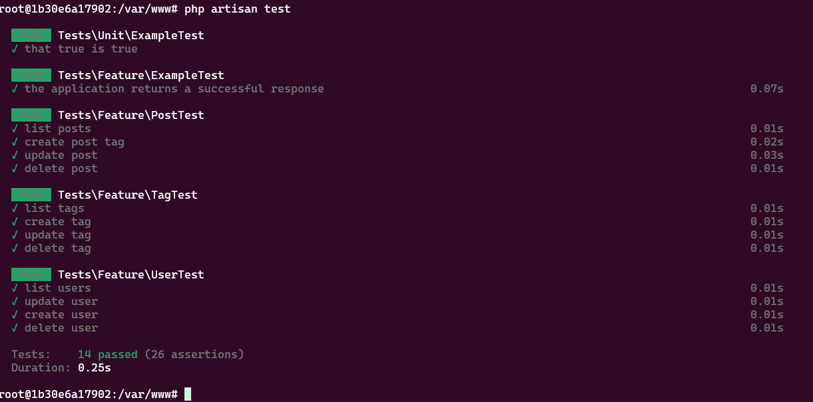
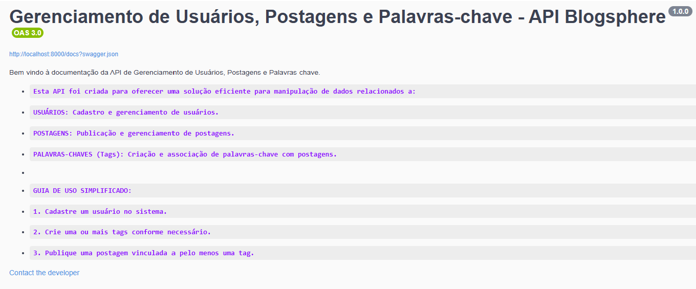
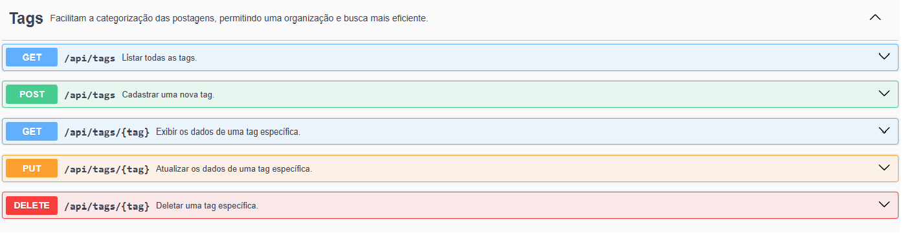
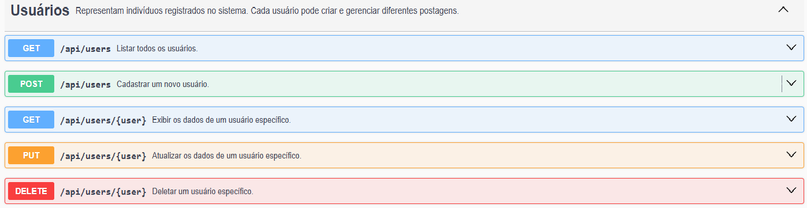
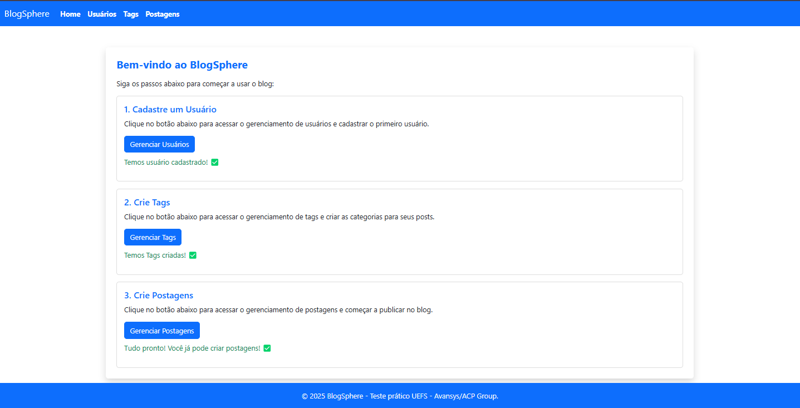
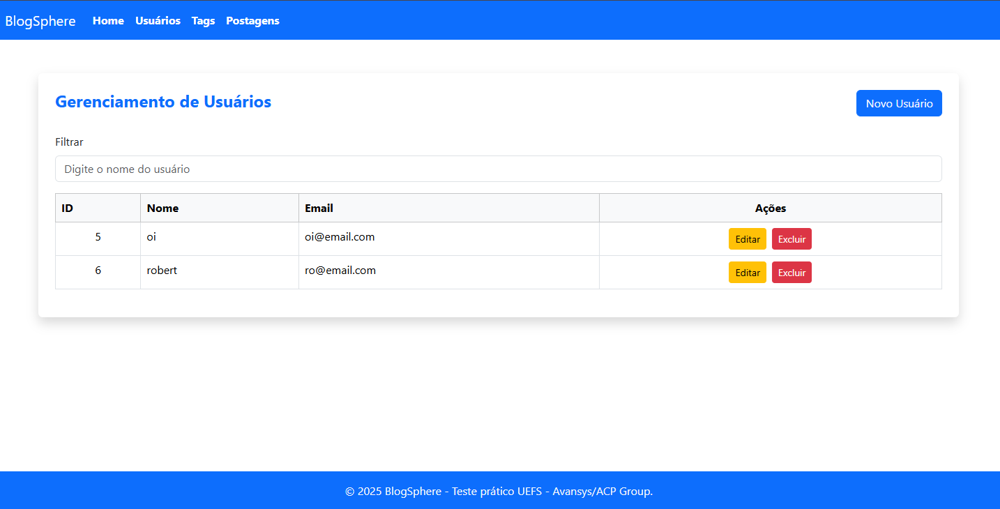
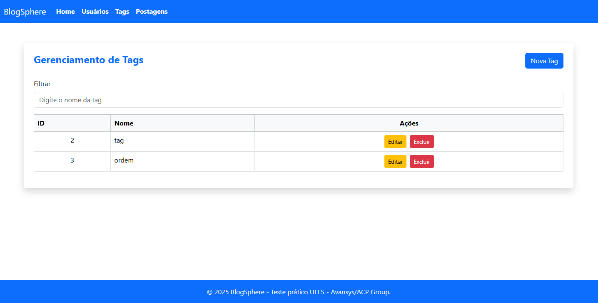
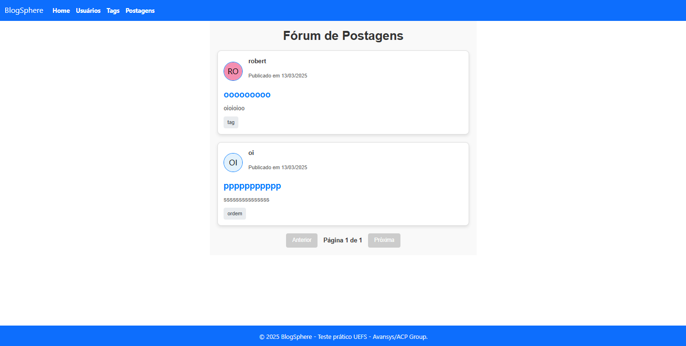
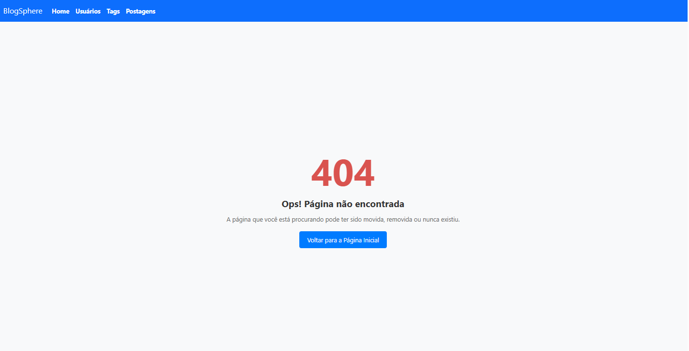

## Teste Técnico UEFS - Avansys/ACP Group
---

## Requisitos do Projeto
Desenvolva uma API em Laravel que inclua o CRUD para:
- Usuários
- Posts
- Tags

### Regras de Modelagem
- O usuário (users) possui diferentes postagens (posts).
- As postagens (posts) possuem várias palavras-chave (tags).

### Endpoints
Implemente os seguintes endpoints com operações CRUD para:
- Usuários
- Posts
- Tags

**Nota:** As rotas devem ser acessadas com o prefixo `/api`. Por exemplo: `/api/posts`  

---

## Estrutura do Projeto
O projeto é composto por duas pastas principais:
- `api-BlogSphere` - Contém a API desenvolvida em Laravel.
- `frontend-BlogSphere` - Contém o frontend desenvolvido em Vue.js.

Cada pasta possui um README específico explicando detalhadamente sua estrutura e funcionamento.

---

## Ambiente de Desenvolvimento com Docker
Para facilitar a execução e configuração do projeto, utilizamos Docker e Docker Compose.

### Tecnologias Utilizadas
- **Backend:** Laravel 11 (PHP 8.3)
- **Banco de Dados:** MySQL 8.0.33
- **Frontend:** Vue.js + Vite

### Instalação e Execução

**Requisitos:**
- Docker e Docker Compose instalados na máquina.

**Passos para rodar o projeto:**
1. Clone o repositório
   ```sh
   git clone https://github.com/sandoelio/test-devs-uefs.git
   ```
2. Acesse a pasta clonada.
   ```sh
   cd test-devs-uefs
   ```
3. Execute:
   ```sh
   docker compose up --build
   ```
4. Aguarde a inicialização dos containers.
---

## Serviços e Portas Utilizadas

| Serviço      | URL de Acesso                  | Porta |
|--------------|--------------------------------|------|
| API Backend | [http://localhost:8000](http://localhost:8000) | 8000 |
| Frontend    | [http://localhost:5173](http://localhost:5173) | 5173 |
| Swagger     | [http://localhost:8000/api/documentation](http://localhost:8000/api/documentation) | 8000 |
| MySQL       | -                              | 3306 |

---

# API Blogsphere

## Descrição
Esta é uma API REST desenvolvida em Laravel 11 com PHP 8.3, utilizando MySQL como banco de dados. A API permite a gestão de Usuários, Tags e Postagens, seguindo o padrão arquitetural MVC com Service e Repository. Os testes são implementados utilizando PHPUnit e Mockery, garantindo a integridade dos serviços. A documentação da API é gerada pelo Swagger (L5-Swagger).

---

## Tecnologias Utilizadas
- **Framework:** Laravel 11
- **Linguagem:** PHP 8.3
- **Banco de Dados:** MySQL
- **Testes:** PHPUnit (^11.0.1) e Mockery (^1.6)
- **Documentação:** L5-Swagger (^9.0)

---

## Endpoints CRUD

### **1. Usuários**
- **Criar Usuário**
  - `POST /api/users`
  - Request Body:
    ```json
    {
      "name": "John Doe",
      "email": "john@example.com",
      "password": "senha123"
    }
    ```
- **Listar Usuários**
  - `GET /api/users`
- **Buscar Usuário por ID**
  - `GET /api/users/{id}`
- **Atualizar Usuário**
  - `PATCH /api/users/{id}`
  - Request Body:
    ```json
    {
      "name": "John Updated",
      "email": "johnupdated@example.com"
    }
    ```
- **Deletar Usuário**
  - `DELETE /api/users/{id}`

---

### **2. Tags**
- **Criar Tag**
  - `POST /api/tags`
  - Request Body:
    ```json
    {
      "name": "Inspirador"
    }
    ```
- **Listar Tags**
  - `GET /api/tags`
- **Buscar Tag por ID**
  - `GET /api/tags/{id}`
- **Atualizar Tag**
  - `PATCH /api/tags/{id}`
- **Deletar Tag**
  - `DELETE /api/tags/{id}`

---

### **3. Postagens**
- **Criar Postagem**
  - `POST /api/posts`
  - Request Body:
    ```json
    {
      "title": "Meu Primeiro Post",
      "content": "Este é um exemplo de postagem.",
      "user_id": 1,
      "tags": [1, 2]
    }
    ```
- **Listar Postagens**
  - `GET /api/posts`
- **Buscar Postagem por ID**
  - `GET /api/posts/{id}`
- **Atualizar Postagem**
  - `PATCH /api/posts/{id}`
- **Deletar Postagem**
  - `DELETE /api/posts/{id}`

---

## **Tratamento de Erros**
A API segue os padrões de respostas HTTP para indicar erros:
- **400 Bad Request** – Dados enviados são inválidos.
- **401 Unauthorized** – Ação requer autenticação.
- **403 Forbidden** – O usuário não tem permissão.
- **404 Not Found** – Recurso não encontrado.
- **422 Unprocessable Entity** – Erro de validação.
- **500 Internal Server Error** – Erro interno do servidor.

Exemplo de resposta para erro 422:
```json
{
  "message": "O campo email é obrigatório.",
  "errors": {
    "email": [
      "O campo email é obrigatório."
    ]
  }
}
```

---

## **Arquitetura da API**
- **Controller:** Responsável por receber as requisições e retornar respostas.
- **Service:** Contém a lógica de negócio.
- **Repository:** Manipula os dados do banco de dados.
- **Models:** Representam as entidades do sistema.

Exemplo de estrutura de pastas:
```
app/
├── Http/
│   ├── Controllers/
│   │   ├── UserController.php
│   │   ├── TagController.php
│   │   ├── PostController.php
├── Models/
│   ├── User.php
│   ├── Tag.php
│   ├── Post.php
├── Services/
│   ├── UserService.php
│   ├── TagService.php
│   ├── PostService.php
├── Repositories/
│   ├── UserRepository.php
│   ├── TagRepository.php
│   ├── PostRepository.php
tests/
├── Feature/
│   ├── UserTest.php
│   ├── TagTest.php
│   ├── PostTest.php

```

---

## **Testes com Mockery e PHPUnit**
Os testes utilizam Mockery para simular serviços e evitar manipulação real do banco de dados.

Exemplo de teste unitário para listar usuários:
```php
public function test_it_can_list_users()
{
    $userServiceMock = Mockery::mock(\App\Services\UserService::class);
    $this->app->instance(\App\Services\UserService::class, $userServiceMock);
    
    $userServiceMock->shouldReceive('getAllUsers')
        ->once()
        ->andReturn([
            ['name' => 'John Doe', 'email' => 'john@example.com'],
            ['name' => 'Jane Doe', 'email' => 'jane@example.com']
        ]);
    
    $response = $this->getJson('/api/users');
    $response->assertStatus(200)
             ->assertJsonCount(2);
}
```

---

## **Documentação com Swagger**
A API utiliza o pacote **L5-Swagger** para documentação interativa. Após configurar o pacote, acesse a documentação via:

```
http://localhost:8000/api/documentation
```


<br>


<br>


<br>



---

## **Próximos Passos**
- Adicionar autenticação.
- Melhorar a validação dos dados de entrada.
- Implementar paginação nas listagens.
---

<h1>BlogSphere Frontend</h1>
Bem-vindo ao BlogSphere Frontend! Este projeto é um frontend construído com Vue.js, que oferece uma interface para gerenciar usuários, postagens, tags e um fórum com paginação.</br> 
O sistema é simples, bem organizado e integrado com uma API backend.

<hr>

📚 **Bibliotecas e Ferramentas Utilizadas**
Abaixo estão as principais ferramentas e bibliotecas utilizadas no desenvolvimento:

* Vue.js: Framework para construção de interfaces reativas e escaláveis.

* Axios: Biblioteca para consumir a API REST.

* Vue Router: Gerenciamento de rotas para navegação no frontend.

* Bootstrap: Biblioteca para estilização responsiva.

* UI Avatars: Gerador de avatares dinâmicos baseado no nome.

* ESLint: Ferramenta para manter a qualidade do código.

* Prettier: Formatação automática de código para maior consistência.

* Node.js: Ambiente de execução JavaScript.

* Vite: Ferramenta para desenvolvimento rápido de aplicações Vue.js.

<hr>

🗂️ **Estrutura do Projeto**
A organização do projeto foi feita para garantir clareza e escalabilidade. Veja abaixo a estrutura dos diretórios:
```
src/
├── components/
│   ├── Navbar.vue         # Menu de navegação no topo
│   ├── Modal.vue          # Componente reutilizável para modais
│
├── pages/
│   ├── Users.vue          # Gerenciamento de usuários
│   ├── Posts.vue          # Gerenciamento de posts
│   ├── Tags.vue           # Gerenciamento de tags
│   ├── Home.vue           # Página inicial
│   ├── Forum.vue          # Página do fórum de discussões
│   ├── NotFound.vue       # Página de erro 404
│
├── router/
│   ├── index.js           # Configuração de rotas
│
├── services/
│   ├── api.js             # Serviço para comunicação com a API
│
├── App.vue                # Componente principal
├── main.js                # Ponto de entrada
```
<hr>

🔧 **Pré-requisitos**

Esses sao os pré-requisitos para rodar o projeto que irão instalar com o docker assim que o projeto for clonado.

* Docker: Ambiente de execução para aplicações em containers.

<hr>

🖼️ **Demonstrações de Tela**

1. **Tela inicial**



2. **Tela de Usuario**.



3. **Tela de Tags**



4. **Tela de Postagens**


2. **Forum**
Tela que exibe as postagens com título, usuário, tags e paginação.



3. **Erro 404**
Página exibida para rotas inexistentes.



<hr>

🚀 **Funcionalidades**

**Nota Importante**: Devido à reatividade do menu no frontend, é necessário atualizar a página manualmente após cada alteração para refletir as mudanças realizadas.

* Gerenciamento de Usuários

    * Listagem, criação, edição e exclusão de usuários.

* Gerenciamento de Postagens

    * Listagem, criação, edição e exclusão de postagens,Ler postagens.

* Gerenciamento de Tags

    * Criação, edição e exclusão de tags associadas às postagens.

<hr>

📐 **Possíveis Melhorias**
* Adicionar sistema de autenticação para rotas protegidas.

* Habilitar upload de imagens para personalizar avatares.

* Melhorar a experiência com notificações para erros e sucessos.


