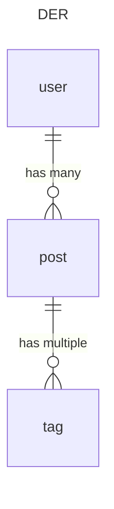

# Instalação

Nescessário instalar 

- `composer` gestor de pacotes do php 
- `php 8.1` ou superior
- Mysql ou PostgreSQL

Instalar as dependências do php

`composer install`

Para rodar a aplicação só precisa do comando

`php artisan serve`

Crie um banco de dados e configure no .env para rodar as migrations da aplicação

`php artisan migrate`

## TESTE

Crie um modelo entidade ralação onde:

- O usuário (users) tem diferentes postagens (posts)
- As postagens (posts) tem multiples palavras-chave tags

Os posts tem os seguintes campos:

- id
- title
- description
- created_at
- updated_at

As tags tem 

- id
- name

> Lembre que tem comandos para criar as migrations, modelos e controllers `php artisan make:model Todo -mc`

> Lembre que nas migrations os campos created_at e updated_at são gerados nas migrations `$table->timestamps();`

## Endpoints

Finalmente crie os endpoints com os verbos HTTP (get, post, put, delete) das seguintes tabelas

#### CRUD (create, read, update e delete) da tabela usuários (users)
 - Rota GET `/users` para lista paginada de usuários
 - Rota GET `/users/{id}` listar um usuário por id
 - Rota POST `/users` salvar um novo usuário
 - Rota PUT `/users/{id}` atualizar um usuário
 - Rota DELETE `/users/{id}` deletar um usuário

#### CRUD (create, read, update e delete) da tabela postagens (posts)
 - Rota GET `/posts` para listar paginada de postagens
 - Rota GET `/posts/{id}` listar uma postagem por id
 - Rota POST `/posts` salvar um novo uma postagem
 - Rota PUT `/posts/{id}` atualizar uma postagem
 - Rota DELETE `/posts/{id}` deletar uma postagem
 - Rota POST `/posts/{id}/tags` associar tags a posts 

### CRUD (create, read, update e delete) da tabela palavras-chave (tags)
 - Rota GET `/tags` para listar paginada de tags
 - Rota GET `/tags/{id}` listar uma tag por id
 - Rota POST `/tags` salvar um novo uma tag
 - Rota PUT `/tags/{id}` atualizar uma tag
 - Rota DELETE `/tags/{id}` deletar uma tag
 
 > As rotas da api podem ser acessadas com o prefixo `api` por exemplo: `/api/posts`
 
 > Lembre que nos métodos de PUT vc precisa enviar uma requisição POST com o parametro `_method = PUT` e no método DELETE deve passar o parâmetro `_method = DELETE` para poder testar no postman ou cliente para interagir com a API
 
 
 
## Serão avaliados

- Uso do framework Laravel 
- Conhecimento sobre modelagem de dados
- Criação de API restfull 

Sucesso e bom teste!
