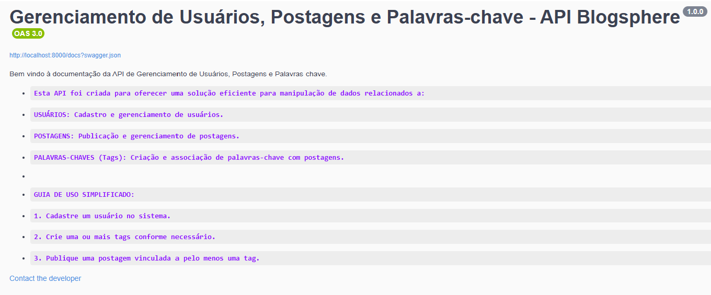
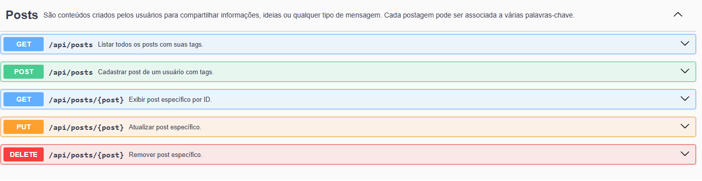
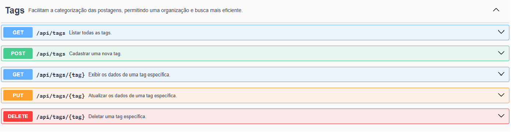
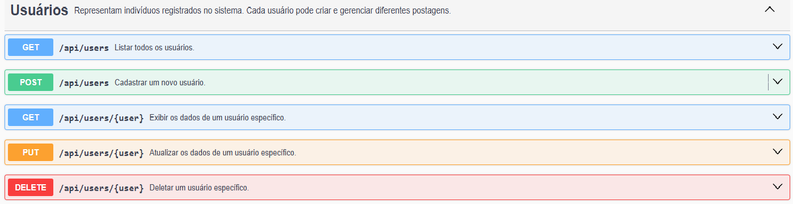

# API Blogsphere

## Descrição
Esta é uma API REST desenvolvida em Laravel 11 com PHP 8.3, utilizando MySQL como banco de dados. A API permite a gestão de Usuários, Tags e Postagens, seguindo o padrão arquitetural MVC com Service e Repository. Os testes são implementados utilizando PHPUnit e Mockery, garantindo a integridade dos serviços. A documentação da API é gerada pelo Swagger (L5-Swagger).

---

## Tecnologias Utilizadas
- **Framework:** Laravel 11
- **Linguagem:** PHP 8.3
- **Banco de Dados:** MySQL
- **Testes:** PHPUnit (^11.0.1) e Mockery (^1.6)
- **Documentação:** L5-Swagger (^9.0)

---

## Endpoints CRUD

### **1. Usuários**
- **Criar Usuário**
  - `POST /api/users`
  - Request Body:
    ```json
    {
      "name": "John Doe",
      "email": "john@example.com",
      "password": "senha123"
    }
    ```
- **Listar Usuários**
  - `GET /api/users`
- **Buscar Usuário por ID**
  - `GET /api/users/{id}`
- **Atualizar Usuário**
  - `PATCH /api/users/{id}`
  - Request Body:
    ```json
    {
      "name": "John Updated",
      "email": "johnupdated@example.com"
    }
    ```
- **Deletar Usuário**
  - `DELETE /api/users/{id}`

---

### **2. Tags**
- **Criar Tag**
  - `POST /api/tags`
  - Request Body:
    ```json
    {
      "name": "Inspirador"
    }
    ```
- **Listar Tags**
  - `GET /api/tags`
- **Buscar Tag por ID**
  - `GET /api/tags/{id}`
- **Atualizar Tag**
  - `PATCH /api/tags/{id}`
- **Deletar Tag**
  - `DELETE /api/tags/{id}`

---

### **3. Postagens**
- **Criar Postagem**
  - `POST /api/posts`
  - Request Body:
    ```json
    {
      "title": "Meu Primeiro Post",
      "content": "Este é um exemplo de postagem.",
      "user_id": 1,
      "tags": [1, 2]
    }
    ```
- **Listar Postagens**
  - `GET /api/posts`
- **Buscar Postagem por ID**
  - `GET /api/posts/{id}`
- **Atualizar Postagem**
  - `PATCH /api/posts/{id}`
- **Deletar Postagem**
  - `DELETE /api/posts/{id}`

---

## **Tratamento de Erros**
A API segue os padrões de respostas HTTP para indicar erros:
- **400 Bad Request** – Dados enviados são inválidos.
- **401 Unauthorized** – Ação requer autenticação.
- **403 Forbidden** – O usuário não tem permissão.
- **404 Not Found** – Recurso não encontrado.
- **422 Unprocessable Entity** – Erro de validação.
- **500 Internal Server Error** – Erro interno do servidor.

Exemplo de resposta para erro 422:
```json
{
  "message": "O campo email é obrigatório.",
  "errors": {
    "email": [
      "O campo email é obrigatório."
    ]
  }
}
```

---

## **Arquitetura da API**
- **Controller:** Responsável por receber as requisições e retornar respostas.
- **Service:** Contém a lógica de negócio.
- **Repository:** Manipula os dados do banco de dados.
- **Models:** Representam as entidades do sistema.

Exemplo de estrutura de pastas:
```
app/
├── Http/
│   ├── Controllers/
│   │   ├── UserController.php
│   │   ├── TagController.php
│   │   ├── PostController.php
├── Models/
│   ├── User.php
│   ├── Tag.php
│   ├── Post.php
├── Services/
│   ├── UserService.php
│   ├── TagService.php
│   ├── PostService.php
├── Repositories/
│   ├── UserRepository.php
│   ├── TagRepository.php
│   ├── PostRepository.php
```

---

## **Testes com Mockery e PHPUnit**
Os testes utilizam Mockery para simular serviços e evitar manipulação real do banco de dados.

Exemplo de teste unitário para listar usuários:
```php
public function test_it_can_list_users()
{
    $userServiceMock = Mockery::mock(\App\Services\UserService::class);
    $this->app->instance(\App\Services\UserService::class, $userServiceMock);
    
    $userServiceMock->shouldReceive('getAllUsers')
        ->once()
        ->andReturn([
            ['name' => 'John Doe', 'email' => 'john@example.com'],
            ['name' => 'Jane Doe', 'email' => 'jane@example.com']
        ]);
    
    $response = $this->getJson('/api/users');
    $response->assertStatus(200)
             ->assertJsonCount(2);
}
```

---

## **Documentação com Swagger**
A API utiliza o pacote **L5-Swagger** para documentação interativa. Após configurar o pacote, acesse a documentação via:

```
http://localhost:8000/api/documentation
```


<br>


<br>


<br>



---

## **Próximos Passos**
- Adicionar autenticação.
- Melhorar a validação dos dados de entrada.
- Implementar paginação nas listagens.
---

Este README será atualizado com mais detalhes conforme a API for evoluindo. 🚀

