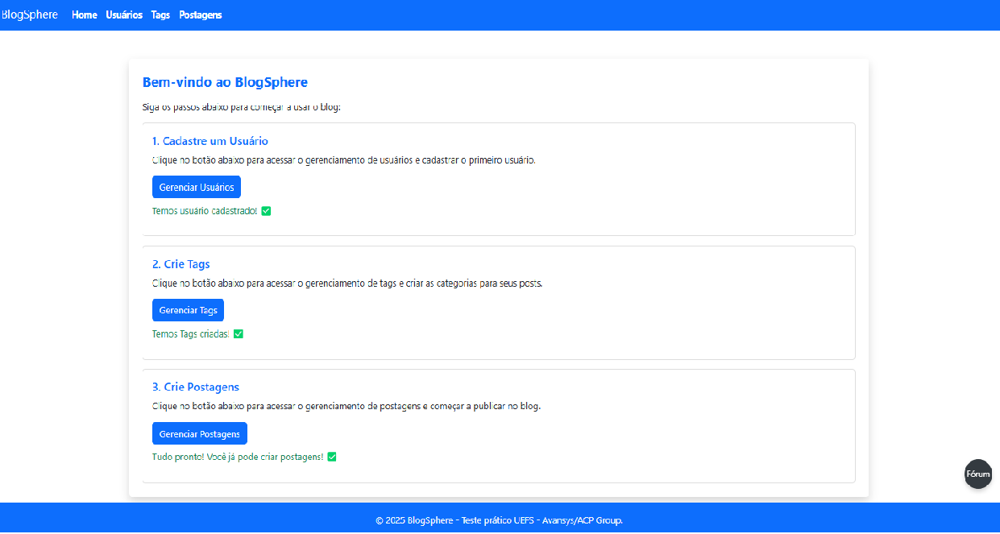
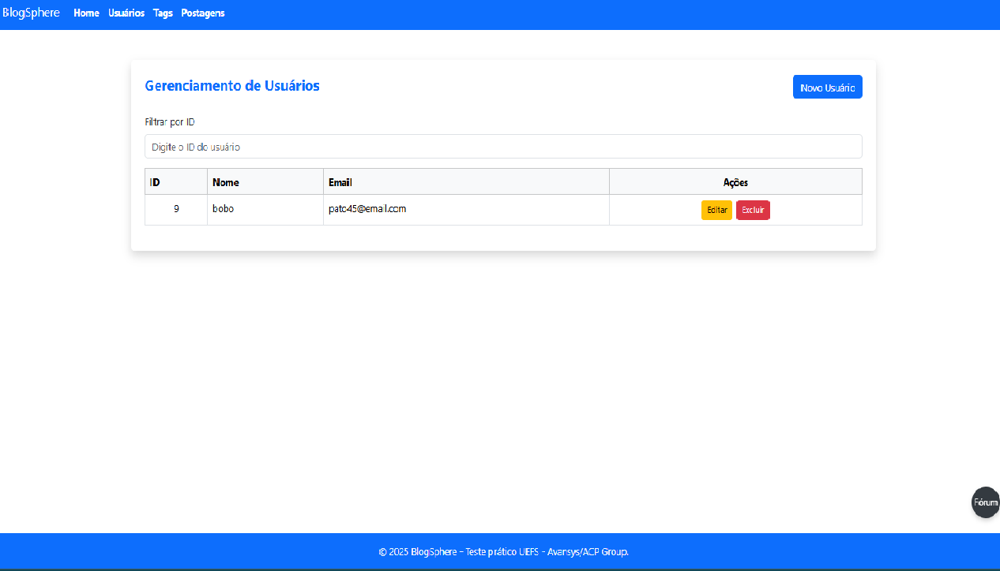
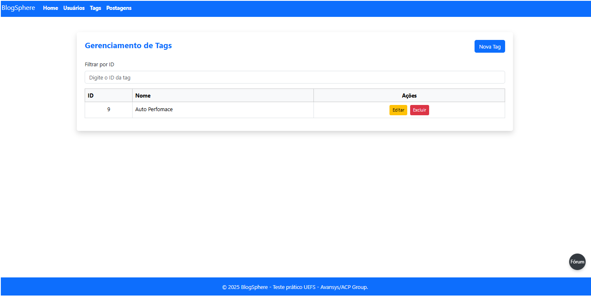
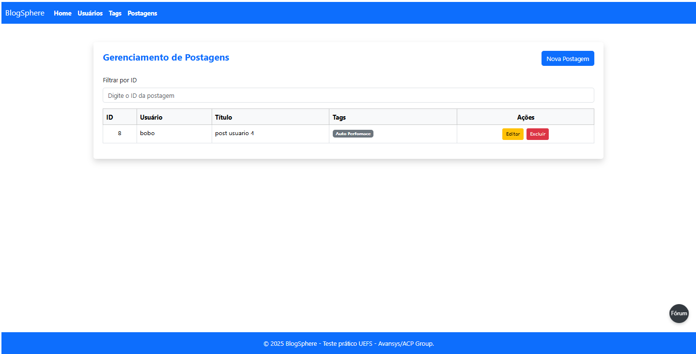
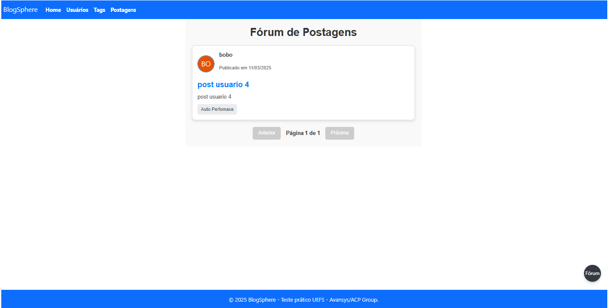
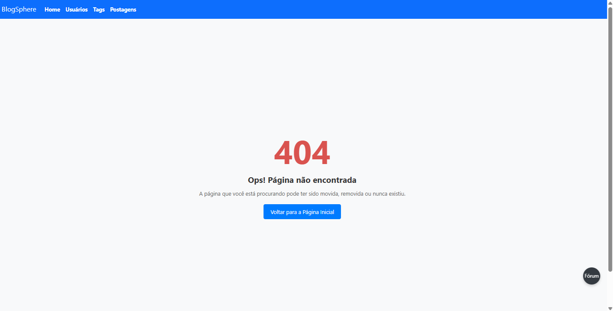

<h1>BlogSphere Frontend</h1>
Bem-vindo ao BlogSphere Frontend! Este projeto é um frontend construído com Vue.js, que oferece uma interface para gerenciar usuários, postagens, tags e um fórum com paginação.</br> 
O sistema é simples, bem organizado e integrado com uma API backend.

<hr>

📚 **Bibliotecas e Ferramentas Utilizadas**
Abaixo estão as principais ferramentas e bibliotecas utilizadas no desenvolvimento:

* Vue.js: Framework para construção de interfaces reativas e escaláveis.

* Axios: Biblioteca para consumir a API REST.

* Vue Router: Gerenciamento de rotas para navegação no frontend.

* Bootstrap: Biblioteca para estilização responsiva.

* UI Avatars: Gerador de avatares dinâmicos baseado no nome.

* ESLint: Ferramenta para manter a qualidade do código.

* Prettier: Formatação automática de código para maior consistência.

* Node.js: Ambiente de execução JavaScript.

* Vite: Ferramenta para desenvolvimento rápido de aplicações Vue.js.

<hr>

🗂️ **Estrutura do Projeto**
A organização do projeto foi feita para garantir clareza e escalabilidade. Veja abaixo a estrutura dos diretórios:
```
src/
├── components/
│   ├── Navbar.vue         # Menu de navegação no topo
│   ├── Modal.vue          # Componente reutilizável para modais
│
├── pages/
│   ├── Users.vue          # Gerenciamento de usuários
│   ├── Posts.vue          # Gerenciamento de posts
│   ├── Tags.vue           # Gerenciamento de tags
│   ├── Home.vue           # Página inicial
│   ├── Forum.vue          # Página do fórum de discussões
│   ├── NotFound.vue       # Página de erro 404
│
├── router/
│   ├── index.js           # Configuração de rotas
│
├── services/
│   ├── api.js             # Serviço para comunicação com a API
│
├── App.vue                # Componente principal
├── main.js                # Ponto de entrada
```
<hr>

🔧 **Pré-requisitos**

Esses sao os pré-requisitos para rodar o projeto que irão instalar com o docker assim que o projeto for clonado.

* Docker: Ambiente de execução para aplicações em containers.

<hr>

🖼️ **Demonstrações de Tela**

1. **Tela inicial**



2. **Tela de Usuario**.



3. **Tela de Tags**



4. **Tela de Postagens**



2. **Forum**
Tela que exibe as postagens com título, usuário, tags e paginação.



3. **Erro 404**
Página exibida para rotas inexistentes.



<hr>

🚀 **Funcionalidades**

* Gerenciamento de Usuários

    * Listagem, criação, edição e exclusão de usuários.

* Gerenciamento de Postagens

    * Listagem, criação, edição e exclusão de postagens.

* Exibição paginada no fórum.

* Gerenciamento de Tags

    * Criação, edição e exclusão de tags associadas às postagens.

<hr>

📐 **Possíveis Melhorias**
* Adicionar sistema de autenticação para rotas protegidas.

* Habilitar upload de imagens para personalizar avatares.

* Melhorar a experiência com notificações para erros e sucessos.
